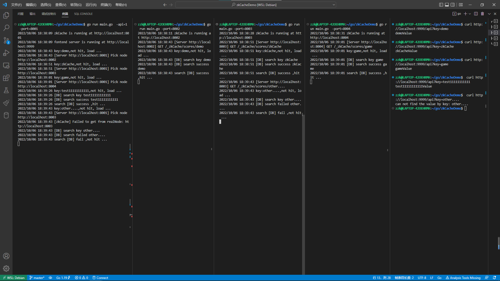
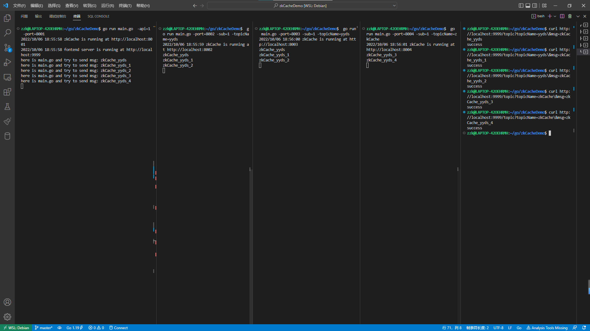

## 如何使用

```
go get github.com/Zhangzk6666/zkCache
```


## 多个节点

````go
var db = map[string]string{
	"demo":            "demoValue",
	"zkCache":         "zkCacheValue",
	"game":            "gameValue",
	"test11111111111": "test11111111111Value",
}

func createController() *zkcache.Controller {
	return zkcache.NewController("Demo", 0, func(key string) (string, error) {
		log.Println("[DB] search key", key)
		if v, ok := db[key]; ok {
			log.Println("[DB] search success", key)
			return v, nil
		}
		log.Println("[DB] search failed", key)
		return "", fmt.Errorf("%s not exist", key)
	}, nil)
}

func startCacheServer(addr string, addrs []string, gee *zkcache.Controller) {
	nodePool := zkcache.NewNodePool(addr)
	nodePool.Set(addrs...)
	gee.RegisterPeers(nodePool)
	log.Println("zkCache is running at", addr)
	log.Fatal(http.ListenAndServe(addr[7:], nodePool))
}

func startAPIServer(apiAddr string, gee *zkcache.Controller) {
	http.Handle("/api", http.HandlerFunc(
		func(w http.ResponseWriter, r *http.Request) {
			key := r.URL.Query().Get("key")
			view, err := gee.Get(key)
			if err != nil {
				http.Error(w, err.Error(), http.StatusInternalServerError)
				return
			}
			w.Header().Set("Content-Type", "application/octet-stream")
			// w.Header().Set("Content-Type", "text/html")
			w.Write([]byte(view))
		}))

	log.Println("server is running at", apiAddr)
	log.Fatal(http.ListenAndServe(apiAddr[7:], nil))

}

func main() {
	var port int
	var api bool
	flag.IntVar(&port, "port", 8001, "zkCache server port")
	flag.BoolVar(&api, "api", false, "Start a api server?")
	flag.Parse()

	apiAddr := "http://localhost:9999"
	addrMap := map[int]string{
		8001: "http://localhost:8001",
		8002: "http://localhost:8002",
		8003: "http://localhost:8003",
		8004: "http://localhost:8004",
	}

	var addrs []string
	for _, v := range addrMap {
		addrs = append(addrs, v)
	}

	zkCache := createController()
	if api {
		go startAPIServer(apiAddr, zkCache)
	}
	startCacheServer(addrMap[port], []string(addrs), zkCache
}
````

> 根据算法分配node节点，例子 demo | zkCache | game | test11111111111 是故意找的，使得每个节点都有被分配
>
> other....  指的是缓存和数据库中没有的key

> test
>
> > ```
> >  go run main.go  -api=1  -port=8001
> >  go run main.go -port=8002
> >  go run main.go -port=8003
> >  go run main.go -port=8004
> > ```
> >
> > ````
> > curl http://localhost:9999/api?key=demo
> > curl http://localhost:9999/api?key=zkCache
> > curl http://localhost:9999/api?key=game
> > curl http://localhost:9999/api?key=test11111111111
> > curl http://localhost:9999/api?key=other....
> > ````


> 有图片，看不到的话可能需要科学上网😅  🤔  




## 发布订阅

````go
package main

import (
	"flag"
	"fmt"
	"log"
	"net/http"
	"os"
	"os/signal"
	zkcache "zkCache/zkCache"
)

var db = map[string]string{
	"demo":            "demoValue",
	"zkCache":         "zkCacheValue",
	"game":            "gameValue",
	"test11111111111": "test11111111111Value",
}

func createController() *zkcache.Controller {
	return zkcache.NewController("scores", 2<<10, func(key string) (string, error) {
		log.Println("[DB] search key", key)
		if v, ok := db[key]; ok {
			log.Println("[DB] search success", key)
			return v, nil
		}
		log.Println("[DB] search failed", key)

		return "", fmt.Errorf("%s not exist", key)

	}, nil)
}

func startCacheServer(addr string, addrs []string, gee *zkcache.Controller) {
	nodePool := zkcache.NewNodePool(addr)
	nodePool.Set(addrs...)
	gee.RegisterPeers(nodePool)
	log.Println("zkCache is running at", addr)
	log.Fatal(http.ListenAndServe(addr[7:], nodePool))
}

func startAPIServer(apiAddr string, gee *zkcache.Controller) {
	http.Handle("/api", http.HandlerFunc(
		func(w http.ResponseWriter, r *http.Request) {
			key := r.URL.Query().Get("key")
			view, err := gee.Get(key)
			if err != nil {
				http.Error(w, err.Error(), http.StatusInternalServerError)
				return
			}
			w.Header().Set("Content-Type", "application/octet-stream")
			// w.Header().Set("Content-Type", "text/html")
			w.Write([]byte(view))

		}))

	// topic
	topic := zkcache.NewController("topic", 0, nil, nil)
	// subscribe
	subscribe := zkcache.NewController("subscribe", 0, nil, nil)
	// public create topic
	http.Handle("/topic", http.HandlerFunc(
		func(w http.ResponseWriter, r *http.Request) {
			topicName := r.URL.Query().Get("topicName")
			msg := r.URL.Query().Get("msg")
			topic.SetTopic(topicName)
			fmt.Println("here is main.go and try to send msg:", msg)
			subscribe.PublicTopicMsg(topicName, msg)
			w.Header().Set("Content-Type", "application/octet-stream")
			w.Write([]byte("success\n"))
		}))

	http.Handle("/subscribe", http.HandlerFunc(
		func(w http.ResponseWriter, r *http.Request) {
			topicName := r.URL.Query().Get("topicName")
			url := r.URL.Query().Get("url")
			subscribe.Subscribe(url, topicName)
			w.Header().Set("Content-Type", "application/octet-stream")
			w.Write([]byte("subscribe success"))
		}))

	http.Handle("/cancelSubscribe", http.HandlerFunc(
		func(w http.ResponseWriter, r *http.Request) {
			url := r.URL.Query().Get("url")
			subscribe.CancelSubscribe(url)
			w.Header().Set("Content-Type", "application/octet-stream")
			w.Write([]byte("cancel subscribe success"))
		}))

	log.Println("fontend server is running at", apiAddr)
	log.Fatal(http.ListenAndServe(apiAddr[7:], nil))

}

func main() {

	stop := make(chan os.Signal, 1)
	signal.Notify(stop, os.Interrupt)

	var port int
	var api bool
	var sub bool
	var topicName string
	flag.IntVar(&port, "port", 8001, "zkCache server port")
	flag.BoolVar(&api, "api", false, "Start a api server?")
	flag.BoolVar(&sub, "sub", false, "Start a api server?")
	flag.StringVar(&topicName, "topicName", "yyds1", "Start a api server?")
	flag.Parse()

	apiAddr := "http://localhost:9999"
	addrMap := map[int]string{
		8001: "http://localhost:8001",
		8002: "http://localhost:8002",
		8003: "http://localhost:8003",
		8004: "http://localhost:8004",
	}

	var addrs []string
	for _, v := range addrMap {
		addrs = append(addrs, v)
	}

	go func() {
		gee := createController()
		if api {
			go startAPIServer(apiAddr, gee)
		}
		if sub {
			http.Get(apiAddr + "/subscribe?topicName=" + topicName + "&url=" + addrMap[port])
		}
		startCacheServer(addrMap[port], []string(addrs), gee)
	}()

	select {
	case <-stop:
		if sub {
			http.Get(apiAddr + "/cancelSubscribe?url=" + addrMap[port])
		}
		return
	}

}
````

> 发布格式
>
> > ```
> > curl http://localhost:xxxx/topic?topicName=xxxx\&msg=xxxx  
> > ```
> >
> > 用 `\&` 而不用`&` 的问题在 `r.URL.Query()`
>
> 订阅格式
>
> >  go run main.go -port=xxxx  -sub=1 -topicName=xxxx


> test
>
> > ````
> > go run main.go  -api=1  -port=8001
> > go run main.go -port=8002 -sub=1 -topicName=yyds
> > go run main.go -port=8003 -sub=1 -topicName=yyds
> > go run main.go -port=8004 -sub=1 -topicName=zkCache
> > ````
> >
> > ```
> > curl http://localhost:9999/topic?topicName=yyds\&msg=zkCache_yyds
> > curl http://localhost:9999/topic?topicName=yyds\&msg=zkCache_yyds_1
> > curl http://localhost:9999/topic?topicName=yyds\&msg=zkCache_yyds_2
> > curl http://localhost:9999/topic?topicName=zkCache\&msg=zkCache_yyds_3
> > curl http://localhost:9999/topic?topicName=zkCache\&msg=zkCache_yyds_4
> > ```


> 有图片，看不到的话可能需要科学上网😅  🤔  
